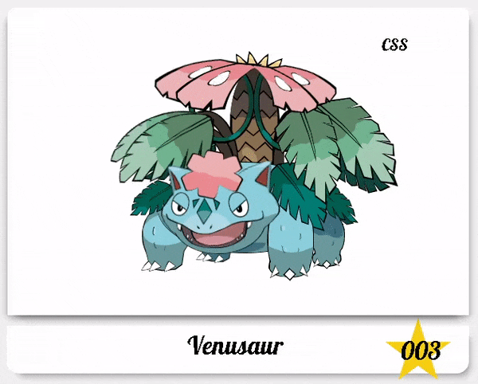

# Dibujo Pokemon (Venusaur) con CSS

<p align="center">
    <a href="https://www.npmjs.com/package/npm"></a>
    <a href="https://www.npmjs.com/package/pug"></a>
    <a href="https://www.npmjs.com/package/sass"></a>
    <a href="LICENSE"></a>
</p>

Dibujo creado a partir de formas b&aacute;sicas, utilizando keyframes para la generaci&oacute;n de movimiento en el personaje.

<details>
  <summary>:eye: Previsualizar</summary>
  <p align="center">
    
  </p>
</details>

---

## :computer: Instalaci&oacute;n

Verificar que se tiene instalado [Node.js][L-nodejs] > 12.

```bash
  $ node --version
  v12.18.3
  $ npm --version
  6.14.6
```

Instalaci&oacute;n de los m&oacute;dulos de node, dentro de la carpeta del proyecto.

```bash
  $ npm install
```

---

## :repeat: Iniciar servidor de desarrollo con recarga autom&aacute;tica

Para iniciar el servidor es necesario correr la instrucci&oacute;n

```bash
  $ npm run buildserver
```

> El servidor se ejecuta en el puerto 9000 y abre autom&aacute;ticamente una ventana del navegador para visualizarlo.

### :link: Demostraci&oacute;n

Previsualizaci&oacute;n del c&oacute;digo en: [CodePen][L-pen-venusaur]

---

## :memo: Licencia

[![Licencia MIT][B-MIT]][L-OSI]

[:page_with_curl: MIT][L-MIT]


<!-- Insignias -->
[B-MIT]:          https://t.ly/JtYj (Licencia MIT)

<!-- Vinculos -->
[L-nodejs]:       https://nodejs.org/es/
[L-pen-venusaur]: https://t.ly/ashT
[L-OSI]:          https://opensource.org/licenses/MIT
[L-MIT]:          https://lbesson.mit-license.org/
